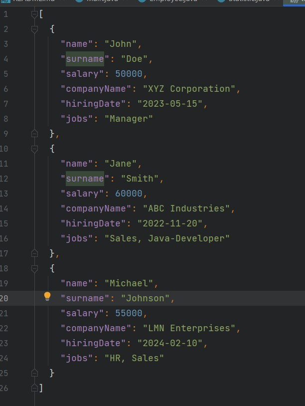

<h1>ProfitSoft Intern Task1</h1>
<h3>1. Description</h3>
<p> Simple Java project, which parses JSON files
and calculates statistic and put it in convenient for user format</p>
<h3>2. Launch instructions</h3>
<ol>
<li>
Clone repository:

```cmd
git clone https://github.com/FilosofDanil/AdventureProGear.git
```

</li>

<li>
Then you have to open configurations in your IDE, in order to fill in the input parameters.
If you would like to launch console application with parameters, here are some instructions:

- Parameters should have the whitespace between them (parameter1 parameter2)
- There are only three parameters(3rd is optional)
- First parameter describes path to directory, where json files stored
- Second is the field, which will be used for counting statistic
- Third is optional parameter and it describes the number of launched threads, it may be used when you would like to speed up your application

Below provided the step by step instruction, for managing your configuration in InteliJIdea IDE.
But it also possible for other IDEs.

Parameter configurations described below:


</li>

<li>
    To launch application just load maven project(in InteliJIdea it takes only few steps: Right Click on pom.xml file -> Add Maven Project).


</li>
<li>
    As soon as all dependencies will downloaded and you add starting configurations, then you just looking for a Main.java class(The entry point) and run it.


</li>
<li>
    NOTICE! If you don't specify configurations or give a wrong input, don't worry, application will start as well, however it will start with default settings, and if you would like to change the parsing process, you should set up configurations before booting.
</li>
</ol>

<h3>3. System estimation</h3>
<ol>
<li>
Entities:

- There are 2 main entities provided: Employees and Companies
- Employee and Company have M:1 relationship
- The main fields which describe Employee: name, surname, companyName, hiringDate, salary, jobs
- Jobs are considered as enum variable and every employee might be hired for different positions    
- Statistic may be counted for every field specified 
</li>

<li>
Project Structure:


</li>

</ol>

<h3>4. Input and output examples</h3>
<ol>
<li>
 JSON input file example:


</li>
<li>
    XML output file example:


</li>
<li>
NOTICE! Output .xml files with counted statistic will be stored in the same directory as JSON files. 
</li>
</ol>
<h3>5. Experiment with threads</h3>
Now I'm going to demonstrate performance increase, using Java Threads.
Our application will be launched with only one thread firstly, then with 2,4,6 and 8 as well.
The output below shows estimated execution time for every case:


One thread(approximately 11 sec elapsed)


Two threads(approximately 6.9 sec elapsed)


Four threads(approximately 5.3 sec elapsed)


Six threads(approximately 4.9 sec elapsed)


One thread(approximately 4.7 sec elapsed)


As a result, we're able to speed up our application, using Java Threads more than twice. However, as we can notice, using all CPU resources doesn't provide significant speeding.
But there is an explanation for this: when some threads finish task more quick than another they would take another task. At the same
time it might be no any other tasks in schedule, so other threads would be finished and that's why it seems like when 4,6,8 threads running
many of them are idle while others finish their work. So, if we would like to notice greatly performance increase - we should run it with more data and much more files.

Despite that facts , we can definitely say that using threads increase performance and it should be used in your projects, 
especially when you care about performance.
